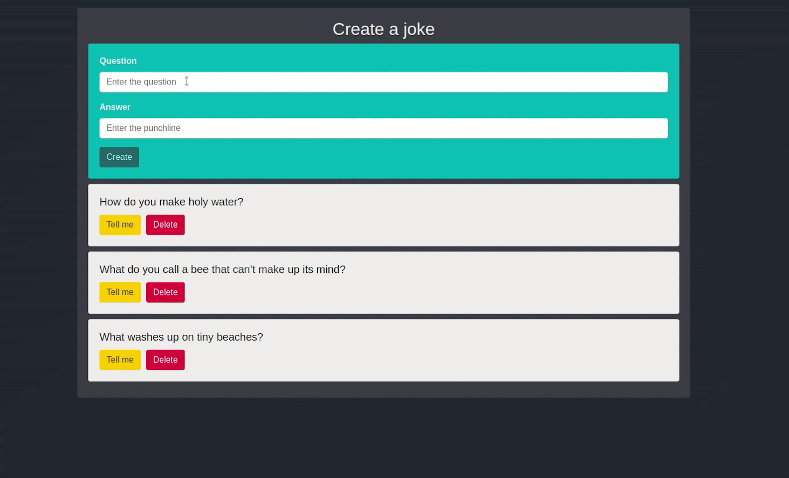
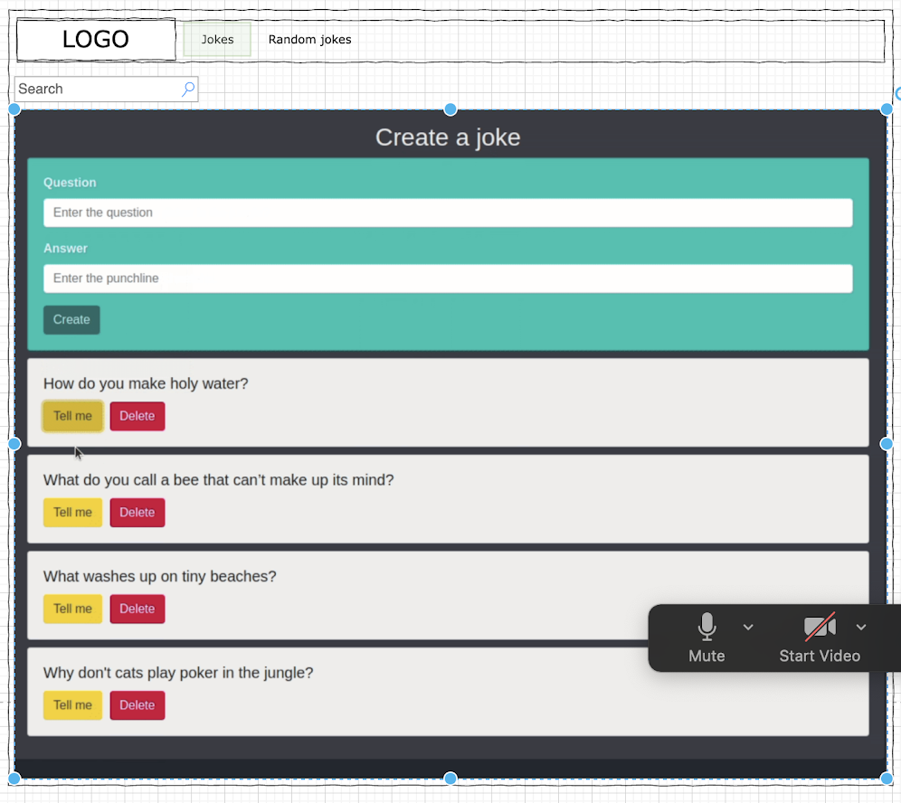

# 37md-joke-app-vue

## UZDEVUMS:
Uztaisīt joku lapu

## NOSACĪJUMI:
1. Ir 2 routes: Jokes un Random jokes
2. /jokes routā var redzēt sarakstu ar jokiem.
3. Katrs joks sastāv no 2 daļām. Jautājums un atbilde.
4. Atbilde ir paslēpta un tiek parādīta, kad nospiež pogu Tell me.
5. Joku var izdzēst nospiežot pogu Delete.
6. Uzspiežot uz joka pariet uz /jokes/:id route un parāda info par konkrēto joku atvērtā veidā. Parāda arī laiku, kurā joks tika izveidots.
7. /jokes var arī pievienot jaunu joku. Pievienojot joku, tam tiek pielikts arī laiks, kad joks tika izveidots. Un viss saraksts glabājas local storage.
8. /random-jokes var redzēt sarakstu ar random jokiem no https://v2.jokeapi.dev/joke/Programming?type=single&amount=10
9. Tāpat kā jokiem local storage arī no api dabūtajiem jokiem var uzspiest un pāriet uz /random-jokes/:id, kur ir paplašināta informācija par joku.
10. Abos routes jābūt iespējai meklēt joku pēc atslēgvārdiem pašā jokā.





## Project setup
```
npm install
```

### Compiles and hot-reloads for development
```
npm run serve
```

### Compiles and minifies for production
```
npm run build
```

### Lints and fixes files
```
npm run lint
```

### Customize configuration
See [Configuration Reference](https://cli.vuejs.org/config/).
